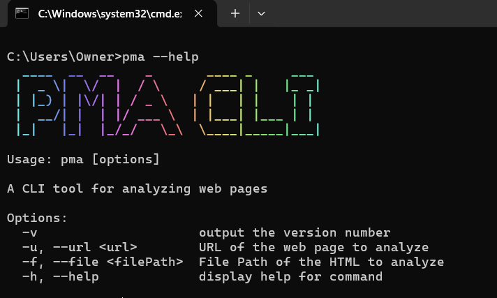
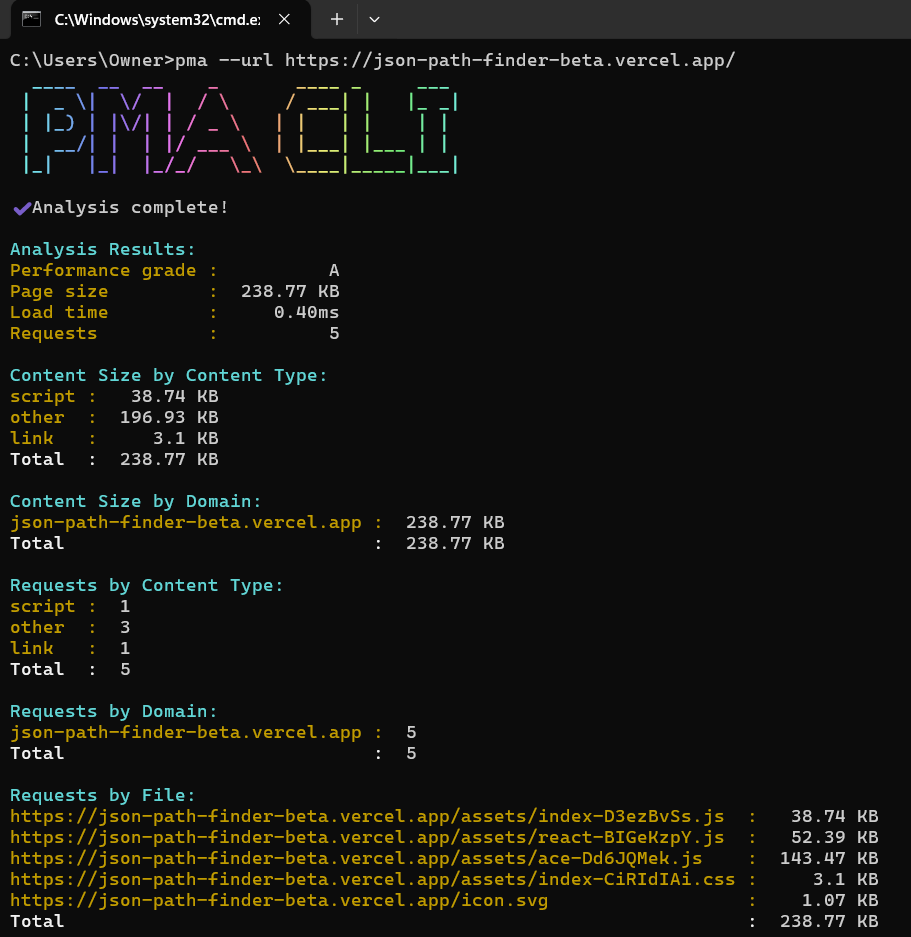

# PMA CLI

## Overview

PMA CLI is a command-line tool for analyzing web pages. It provides insights into performance metrics, content sizes, and requests made by a web page. This tool can analyze either a URL or local HTML file content, helping developers understand their web page's performance.

## Features

- Analyze web pages via URL or local HTML file.
- Display performance metrics such as page size, load time, and requests.
- Organized output in a readable format.

## Installation

To install the necessary dependencies, run:

```bash
npm install -g pma-cli
```

## Usage

To run the CLI, use the following command in your terminal:

```bash
pma -v
```

### Command Options

*   `-u, --url <url>`: Specify the URL of the web page to analyze.
*   `-f, --file <filePath>`: Specify the file path of the HTML content to analyze.
*   `-v`: Displays the version Info
*   `-h, --help`: Displays command options 

### Example Help



### Interactive Mode

If neither the URL nor the file option is provided, the CLI will prompt you to choose between analyzing a URL or HTML content.

### Example

```bash
pma --url https://example.com
```
or

```bash
pma --file /path/to/local/file.html
```

## Analysis Results

After analysis, the results are displayed in a structured format, including:

*   **Performance Grade**
*   **Page Size**
*   **Load Time**
*   **Number of Requests**

### Example Output



## License

This project is licensed under the MIT License.
